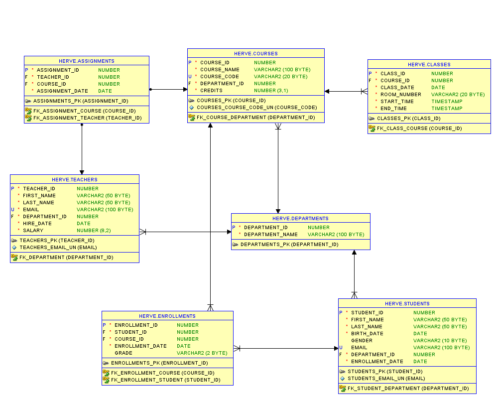

# School Database Management System (Using Oracle as RDBMS)

This README provides an overview of creating a School Database Management System using Oracle SQL and PL/SQL Developer. The database manages critical information about teachers, students, departments, courses, enrollments, assignments, and class schedules within a school.
## Table Structures

### Departments table

```sql
CREATE TABLE departments (
    department_id NUMBER GENERATED BY DEFAULT AS IDENTITY PRIMARY KEY,
    department_name VARCHAR2(100) NOT NULL
);
```


## teachers Table

```sql
CREATE TABLE teachers (
    teacher_id NUMBER GENERATED BY DEFAULT AS IDENTITY PRIMARY KEY,
    first_name VARCHAR2(50) NOT NULL,
    last_name VARCHAR2(50) NOT NULL,
    email VARCHAR2(100) UNIQUE NOT NULL,
    department_id NUMBER NOT NULL,
    hire_date DATE NOT NULL,
    salary NUMBER(8, 2) NOT NULL,
    CONSTRAINT fk_department
        FOREIGN KEY (department_id) 
        REFERENCES departments (department_id)
);
```

## students Table

```sql
CREATE TABLE students (
    student_id NUMBER GENERATED BY DEFAULT AS IDENTITY PRIMARY KEY,
    first_name VARCHAR2(50) NOT NULL,
    last_name VARCHAR2(50) NOT NULL,
    birth_date DATE NOT NULL,
    gender VARCHAR2(10),
    email VARCHAR2(100) UNIQUE,
    department_id NUMBER NOT NULL,
    enrollment_date DATE NOT NULL,
    CONSTRAINT fk_student_department
        FOREIGN KEY (department_id) 
        REFERENCES departments (department_id)
);

```


## courses Table

```sql
CREATE TABLE courses (
    course_id NUMBER GENERATED BY DEFAULT AS IDENTITY PRIMARY KEY,
    course_name VARCHAR2(100) NOT NULL,
    course_code VARCHAR2(20) UNIQUE NOT NULL,
    department_id NUMBER NOT NULL,
    credits NUMBER(3, 1) NOT NULL,
    CONSTRAINT fk_course_department
        FOREIGN KEY (department_id) 
        REFERENCES departments (department_id)
);
```


## enrollments Table
```sql
CREATE TABLE enrollments (
    enrollment_id NUMBER GENERATED BY DEFAULT AS IDENTITY PRIMARY KEY,
    student_id NUMBER NOT NULL,
    course_id NUMBER NOT NULL,
    enrollment_date DATE NOT NULL,
    grade VARCHAR2(2),
    CONSTRAINT fk_enrollment_student
        FOREIGN KEY (student_id) 
        REFERENCES students (student_id),
    CONSTRAINT fk_enrollment_course
        FOREIGN KEY (course_id) 
        REFERENCES courses (course_id)
);

```


## assignments Table
```sql
CREATE TABLE assignments (
    assignment_id NUMBER GENERATED BY DEFAULT AS IDENTITY PRIMARY KEY,
    teacher_id NUMBER NOT NULL,
    course_id NUMBER NOT NULL,
    assignment_date DATE NOT NULL,
    CONSTRAINT fk_assignment_teacher
        FOREIGN KEY (teacher_id) 
        REFERENCES teachers (teacher_id),
    CONSTRAINT fk_assignment_course
        FOREIGN KEY (course_id) 
        REFERENCES courses (course_id)
);

```

## classes Table
```sql
CREATE TABLE classes (
    class_id NUMBER GENERATED BY DEFAULT AS IDENTITY PRIMARY KEY,
    course_id NUMBER NOT NULL,
    class_date DATE NOT NULL,
    room_number VARCHAR2(20) NOT NULL,
    start_time TIMESTAMP NOT NULL,
    end_time TIMESTAMP NOT NULL,
    CONSTRAINT fk_class_course
        FOREIGN KEY (course_id) 
        REFERENCES courses (course_id)
);

```


# Inserting Records

 insert records into the tables

## Insert departments

```sql
INSERT INTO departments (department_name) VALUES ('Mathematics');
INSERT INTO departments (department_name) VALUES ('Computer Science');
INSERT INTO departments (department_name) VALUES ('Physics');
INSERT INTO departments (department_name) VALUES ('Biology');
INSERT INTO departments (department_name) VALUES ('Chemistry');
```


## Insert teachers

```sql 
INSERT INTO teachers (first_name, last_name, email, department_id, hire_date, salary) 
VALUES ('John', 'Doe', 'john.doe@school.edu', 1, TO_DATE('2020-08-01', 'YYYY-MM-DD'), 50000);
INSERT INTO teachers (first_name, last_name, email, department_id, hire_date, salary) 
VALUES ('Jane', 'Smith', 'jane.smith@school.edu', 2, TO_DATE('2019-06-15', 'YYYY-MM-DD'), 60000);
INSERT INTO teachers (first_name, last_name, email, department_id, hire_date, salary) 
VALUES ('Albert', 'Brown', 'albert.brown@school.edu', 3, TO_DATE('2018-09-23', 'YYYY-MM-DD'), 55000);
INSERT INTO teachers (first_name, last_name, email, department_id, hire_date, salary) 
VALUES ('Lisa', 'White', 'lisa.white@school.edu', 4, TO_DATE('2021-01-10', 'YYYY-MM-DD'), 53000);
INSERT INTO teachers (first_name, last_name, email, department_id, hire_date, salary) 
VALUES ('Michael', 'Green', 'michael.green@school.edu', 5, TO_DATE('2017-03-18', 'YYYY-MM-DD'), 58000);
```


## Insert students

```sql
INSERT INTO students (first_name, last_name, birth_date, gender, email, department_id, enrollment_date)
VALUES ('Alice', 'Johnson', TO_DATE('2002-05-21', 'YYYY-MM-DD'), 'Female', 'alice.johnson@school.edu', 1, TO_DATE('2022-09-01', 'YYYY-MM-DD'));
INSERT INTO students (first_name, last_name, birth_date, gender, email, department_id, enrollment_date)
VALUES ('Bob', 'Williams', TO_DATE('2001-11-15', 'YYYY-MM-DD'), 'Male', 'bob.williams@school.edu', 2, TO_DATE('2021-09-01', 'YYYY-MM-DD'));
INSERT INTO students (first_name, last_name, birth_date, gender, email, department_id, enrollment_date)
VALUES ('Charlie', 'Davis', TO_DATE('2003-03-10', 'YYYY-MM-DD'), 'Male', 'charlie.davis@school.edu', 3, TO_DATE('2023-09-01', 'YYYY-MM-DD'));
INSERT INTO students (first_name, last_name, birth_date, gender, email, department_id, enrollment_date)
VALUES ('Diana', 'Miller', TO_DATE('2002-07-30', 'YYYY-MM-DD'), 'Female', 'diana.miller@school.edu', 4, TO_DATE('2022-09-01', 'YYYY-MM-DD'));
INSERT INTO students (first_name, last_name, birth_date, gender, email, department_id, enrollment_date)
VALUES ('Eve', 'Martinez', TO_DATE('2001-12-12', 'YYYY-MM-DD'), 'Female', 'eve.martinez@school.edu', 5, TO_DATE('2021-09-01', 'YYYY-MM-DD'));
```


## Insert courses

```sql
INSERT INTO courses (course_name, course_code, department_id, credits)
VALUES ('Algebra I', 'MATH101', 1, 3.0);
INSERT INTO courses (course_name, course_code, department_id, credits)
VALUES ('Introduction to Programming', 'CS101', 2, 4.0);
INSERT INTO courses (course_name, course_code, department_id, credits)
VALUES ('Classical Mechanics', 'PHYS101', 3, 3.5);
INSERT INTO courses (course_name, course_code, department_id, credits)
VALUES ('Cell Biology', 'BIO101', 4, 3.0);
INSERT INTO courses (course_name, course_code, department_id, credits)
VALUES ('Organic Chemistry', 'CHEM101', 5, 3.5);
```


## Insert enrollments

```sql
INSERT INTO enrollments (student_id, course_id, enrollment_date, grade)
VALUES (1, 1, TO_DATE('2022-09-05', 'YYYY-MM-DD'), 'A');
INSERT INTO enrollments (student_id, course_id, enrollment_date, grade)
VALUES (2, 2, TO_DATE('2021-09-05', 'YYYY-MM-DD'), 'B+');
INSERT INTO enrollments (student_id, course_id, enrollment_date, grade)
VALUES (3, 3, TO_DATE('2023-09-05', 'YYYY-MM-DD'), 'A-');
INSERT INTO enrollments (student_id, course_id, enrollment_date, grade)
VALUES (4, 4, TO_DATE('2022-09-05', 'YYYY-MM-DD'), 'B');
INSERT INTO enrollments (student_id, course_id, enrollment_date, grade)
VALUES (5, 5, TO_DATE('2021-09-05', 'YYYY-MM-DD'), 'A');
```


## Insert assignments

```sql
INSERT INTO assignments (teacher_id, course_id, assignment_date)
VALUES (1, 1, TO_DATE('2020-08-01', 'YYYY-MM-DD'));
INSERT INTO assignments (teacher_id, course_id, assignment_date)
VALUES (2, 2, TO_DATE('2019-06-15', 'YYYY-MM-DD'));
INSERT INTO assignments (teacher_id, course_id, assignment_date)
VALUES (3, 3, TO_DATE('2018-09-23', 'YYYY-MM-DD'));
INSERT INTO assignments (teacher_id, course_id, assignment_date)
VALUES (4, 4, TO_DATE('2021-01-10', 'YYYY-MM-DD'));
INSERT INTO assignments (teacher_id, course_id, assignment_date)
VALUES (5, 5, TO_DATE('2017-03-18', 'YYYY-MM-DD'));
```


## Insert classes

```sql
INSERT INTO classes (course_id, class_date, room_number, start_time, end_time)
VALUES (1, TO_DATE('2023-01-15', 'YYYY-MM-DD'), 'Room A1', TO_TIMESTAMP('09:00:00', 'HH24:MI:SS'), TO_TIMESTAMP('11:00:00', 'HH24:MI:SS'));
INSERT INTO classes (course_id, class_date, room_number, start_time, end_time)
VALUES (2, TO_DATE('2023-01-16', 'YYYY-MM-DD'), 'Room B2', TO_TIMESTAMP('10:00:00', 'HH24:MI:SS'), TO_TIMESTAMP('12:00:00', 'HH24:MI:SS'));
INSERT INTO classes (course_id, class_date, room_number, start_time, end_time)
VALUES (3, TO_DATE('2023-01-17', 'YYYY-MM-DD'), 'Room C3', TO_TIMESTAMP('08:00:00', 'HH24:MI:SS'), TO_TIMESTAMP('10:00:00', 'HH24:MI:SS'));
INSERT INTO classes (course_id, class_date, room_number, start_time, end_time)
VALUES (4, TO_DATE('2023-01-18', 'YYYY-MM-DD'), 'Room D4', TO_TIMESTAMP('11:00:00', 'HH24:MI:SS'), TO_TIMESTAMP('13:00:00', 'HH24:MI:SS'));
INSERT INTO classes (course_id, class_date, room_number, start_time, end_time)
VALUES (5, TO_DATE('2023-01-19', 'YYYY-MM-DD'), 'Room E5', TO_TIMESTAMP('09:30:00', 'HH24:MI:SS'), TO_TIMESTAMP('11:30:00', 'HH24:MI:SS'));

```


## Conceptual, Logical and Physical Data Model



## Conclusion

 this School Database Management System provides a structured and efficient way to manage various academic activities, such as student enrollments, teacher assignments, course scheduling, and more. By implementing this database, institutions can effectively handle their data, perform critical queries, and gain insights into academic performance and resource management. The system is designed with scalability in mind, allowing for future extensions and customizations to meet the evolving needs of the schoo.

### License

This project is licensed under the [MIT License](https://opensource.org/licenses/MIT). You can freely use, copy, modify, and distribute this software, but please include a copy of this license in any distributions.
